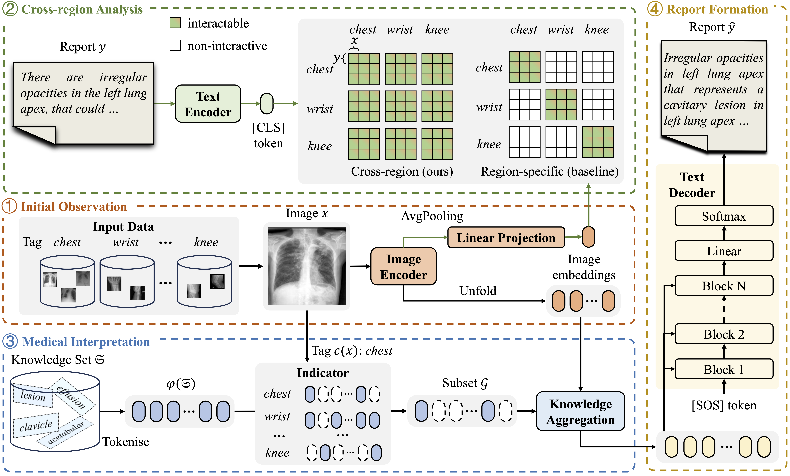

# Official pytorch implementation of “X-RGen”

<p align="left">
    
</p>

This repo holds the Pytorch implementation of X-RGen:<br />

**[ACCV2024 (oral)][Act Like a Radiologist: Radiology Report Generation across Anatomical Regions](https://openaccess.thecvf.com/content/ACCV2024/html/Chen_Act_Like_a_Radiologist_Radiology_Report_Generation_across_Anatomical_Regions_ACCV_2024_paper.html)** 

## Usage
* Create a new conda environment 
```
conda create --name xrgen python=3.7
source activate xrgen
```
* Clone this repo
```
git clone https://github.com/YtongXie/X-RGen.git
cd X-RGen
```

## Installation 
* Install packages
```
pip install torch==1.13.1+cu116 torchvision==0.14.1+cu116 torchaudio==0.13.1 --extra-index-url https://download.pytorch.org/whl/cu116
pip install -r requirements.txt

cd pycocoevalcap
Download the pycocoevalcap package from [here](https://drive.google.com/drive/folders/1WFxcn2G2bUG-bp7pMEXKxrFWyk1rZmbh?usp=drive_link) and place them in the `pycocoevalcap` directory.
```


## Download our X-RGen weights
You can download the models we trained for our dataset from [here](https://drive.google.com/file/d/1mkT3PcrE_s9vkjqg_Vn5rdmh-z2bhfa6/view?usp=drive_link).

## Data Preparation
* We will not disclose our private data in order to protect privacy. To utilize our code, please format your data according to the specifications outlined below. <br/>
* Put the image data under `data/images/` should be like:
```
      ├── CXR2384_IM-0942/
          ├── 0.png
          ├── 1.png
      ├── CXR2926_IM-1328/
          ├── 0.png
          ├── 1.png
```
* Put the report data under `data/annotation.json` should be like the example in `data/annotation_example.json`

## Training
* Please download the pre-trained weights for MedCLIP from [here](https://storage.googleapis.com/pytrial/medclip-pretrained.zip) and place them in the `models` directory.
* Run
```
python main_train_XRGen.py --batch_size 192 --save_dir results/XRGen
```
to train a model on your data.

## Inference
* Run
```
python main_test_XRGen.py --batch_size 192 --save_dir results/XRGen --load results/XRGen/model_best.pth
```
for inference.


### Acknowledgements
Part of codes are reused from the [R2Gen](https://github.com/cuhksz-nlp/R2Gen) and [MedCLIP](https://github.com/RyanWangZf/MedCLIP) for medical visual-language pre-training. Thanks to all authors from R2Gen and MedCLIP.


### Contact
Yutong Xie (yutong.xie678@gmail.com)
